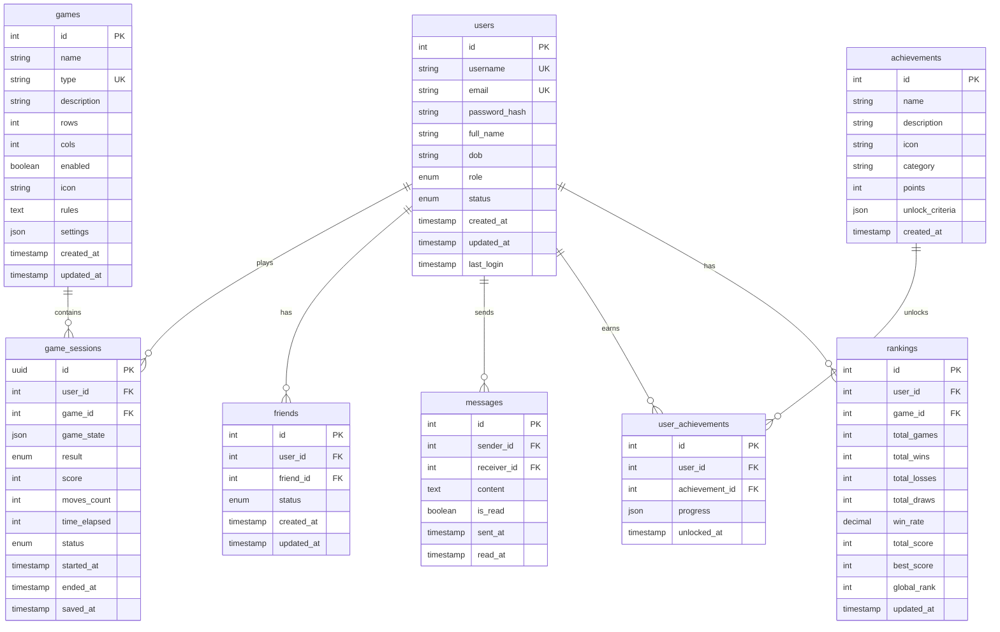
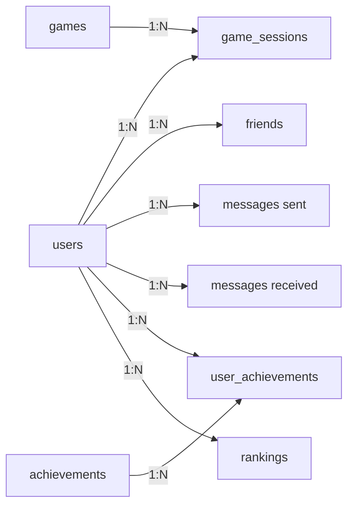

# Tài Liệu Cơ Sở Dữ Liệu - Board Game Website

## Mục Lục
1. [Tổng Quan](#tổng-quan)
2. [Sơ Đồ ERD](#sơ-đồ-erd)
3. [Chi Tiết Các Bảng](#chi-tiết-các-bảng)
4. [Mối Quan Hệ](#mối-quan-hệ)
5. [Indexes & Constraints](#indexes--constraints)
6. [Use Cases](#use-cases)

---

## Tổng Quan

Cơ sở dữ liệu được thiết kế cho một nền tảng web chơi board game trực tuyến, hỗ trợ:
- Quản lý người dùng và xác thực
- Nhiều loại board game khác nhau
- Lưu trữ và tiếp tục game sessions
- Hệ thống bạn bè và nhắn tin
- Achievements và gamification
- Bảng xếp hạng (cá nhân, bạn bè, toàn cầu)

**Database Engine**: PostgreSQL  
**ORM/Query Builder**: Knex.js  
**Total Tables**: 8

---

## Sơ Đồ ERD



---

## Chi Tiết Các Bảng

### `users` - Quản Lý Người Dùng

**Mục đích**: Lưu trữ thông tin người dùng, xác thực và phân quyền.

| Column | Type | Constraints | Description |
|--------|------|-------------|-------------|
| `id` | INTEGER | PRIMARY KEY, AUTO_INCREMENT | ID duy nhất của user |
| `username` | VARCHAR(50) | UNIQUE, NOT NULL | Tên đăng nhập |
| `email` | VARCHAR(255) | UNIQUE, NOT NULL | Email đăng ký |
| `password_hash` | VARCHAR(255) | NOT NULL | Mật khẩu đã hash (bcrypt) |
| `full_name` | VARCHAR(100) | NULL | Họ tên đầy đủ |
| `dob` | DATE | NULL | Ngày sinh |
| `role` | ENUM | DEFAULT 'user' | Vai trò: `admin`, `moderator`, `user` |
| `status` | ENUM | DEFAULT 'active' | Trạng thái: `active`, `inactive`, `banned` |
| `created_at` | TIMESTAMP | DEFAULT NOW() | Thời gian tạo tài khoản |
| `updated_at` | TIMESTAMP | DEFAULT NOW() | Thời gian cập nhật cuối |
| `last_login` | TIMESTAMP | NULL | Lần đăng nhập cuối |

**Business Rules**:
- Username phải unique và không phân biệt hoa thường
- Email phải hợp lệ và unique
- Password phải hash bằng bcrypt (cost factor >= 10)
- User mới mặc định có role = 'user' và status = 'active'

**Indexes**:
```sql
CREATE UNIQUE INDEX idx_users_username ON users(LOWER(username));
CREATE UNIQUE INDEX idx_users_email ON users(LOWER(email));
CREATE INDEX idx_users_status ON users(status);
CREATE INDEX idx_users_role ON users(role);
```

---

### `games` - Danh Sách Board Games

**Mục đích**: Quản lý các loại board game có sẵn trên hệ thống.

| Column | Type | Constraints | Description |
|--------|------|-------------|-------------|
| `id` | INTEGER | PRIMARY KEY, AUTO_INCREMENT | ID duy nhất của game |
| `name` | VARCHAR(100) | NOT NULL | Tên game (hiển thị) |
| `type` | VARCHAR(50) | UNIQUE, NOT NULL | Loại game (slug): `tic-tac-toe`, `chess`, `checkers` |
| `description` | TEXT | NULL | Mô tả game |
| `rows` | INTEGER | NOT NULL | Số hàng của bàn chơi |
| `cols` | INTEGER | NOT NULL | Số cột của bàn chơi |
| `enabled` | BOOLEAN | DEFAULT true | Game có được kích hoạt không |
| `icon` | VARCHAR(255) | NULL | URL icon của game |
| `rules` | TEXT | NULL | Luật chơi (markdown/HTML) |
| `settings` | JSON | NULL | Cấu hình mặc định của game |
| `created_at` | TIMESTAMP | DEFAULT NOW() | Thời gian thêm game |
| `updated_at` | TIMESTAMP | DEFAULT NOW() | Thời gian cập nhật |

**Business Rules**:
- `type` phải unique (dùng làm identifier trong code)
- `rows` và `cols` phải > 0
- `settings` có thể chứa: time_limit, difficulty_levels, custom_rules, etc.

**Ví dụ `settings` JSON**:
```json
{
  "time_limit": 600,
  "difficulty_levels": ["easy", "medium", "hard"],
  "allow_undo": true,
  "max_players": 2,
  "scoring_system": {
    "win": 100,
    "draw": 50,
    "loss": 0
  }
}
```

**Indexes**:
```sql
CREATE UNIQUE INDEX idx_games_type ON games(type);
CREATE INDEX idx_games_enabled ON games(enabled);
```

---

### `game_sessions` - Phiên Chơi Game

**Mục đích**: Lưu trữ trạng thái và kết quả của mỗi lần chơi game.

| Column | Type | Constraints | Description |
|--------|------|-------------|-------------|
| `id` | UUID | PRIMARY KEY | ID duy nhất của session |
| `user_id` | INTEGER | FOREIGN KEY → users(id) | Người chơi |
| `game_id` | INTEGER | FOREIGN KEY → games(id) | Loại game |
| `game_state` | JSON | NOT NULL | Trạng thái bàn chơi hiện tại |
| `result` | ENUM | NULL | Kết quả: `win`, `loss`, `draw` |
| `score` | INTEGER | DEFAULT 0 | Điểm số đạt được |
| `moves_count` | INTEGER | DEFAULT 0 | Số nước đã đi |
| `time_elapsed` | INTEGER | DEFAULT 0 | Thời gian chơi (giây) |
| `status` | ENUM | DEFAULT 'in_progress' | Trạng thái: `in_progress`, `completed`, `abandoned` |
| `started_at` | TIMESTAMP | DEFAULT NOW() | Thời gian bắt đầu |
| `ended_at` | TIMESTAMP | NULL | Thời gian kết thúc |
| `saved_at` | TIMESTAMP | DEFAULT NOW() | Lần lưu cuối cùng |

**Business Rules**:
- `id` dùng UUID để tránh conflict trong distributed system
- `game_state` lưu toàn bộ trạng thái để có thể resume game
- `result` chỉ được set khi `status` = 'completed'
- `ended_at` phải > `started_at`
- `moves_count` và `score` phải >= 0

**Ví dụ `game_state` JSON (Tic-Tac-Toe)**:
```json
{
  "board": [
    ["X", "O", "X"],
    ["O", "X", "O"],
    [null, null, "X"]
  ],
  "current_player": "O",
  "move_history": [
    {"player": "X", "position": [0, 0], "timestamp": "2025-12-30T10:00:00Z"},
    {"player": "O", "position": [0, 1], "timestamp": "2025-12-30T10:00:05Z"}
  ],
  "difficulty": "medium"
}
```

**Indexes**:
```sql
CREATE INDEX idx_sessions_user_id ON game_sessions(user_id);
CREATE INDEX idx_sessions_game_id ON game_sessions(game_id);
CREATE INDEX idx_sessions_user_game ON game_sessions(user_id, game_id);
CREATE INDEX idx_sessions_status ON game_sessions(status);
CREATE INDEX idx_sessions_started_at ON game_sessions(started_at DESC);
```

---

### `friends` - Quan Hệ Bạn Bè

**Mục đích**: Quản lý mối quan hệ bạn bè giữa các user.

| Column | Type | Constraints | Description |
|--------|------|-------------|-------------|
| `id` | INTEGER | PRIMARY KEY, AUTO_INCREMENT | ID duy nhất |
| `user_id` | INTEGER | FOREIGN KEY → users(id) | Người gửi lời mời |
| `friend_id` | INTEGER | FOREIGN KEY → users(id) | Người nhận lời mời |
| `status` | ENUM | DEFAULT 'pending' | Trạng thái: `pending`, `accepted`, `rejected`, `blocked` |
| `created_at` | TIMESTAMP | DEFAULT NOW() | Thời gian gửi lời mời |
| `updated_at` | TIMESTAMP | DEFAULT NOW() | Thời gian cập nhật trạng thái |

**Business Rules**:
- Không thể kết bạn với chính mình: `user_id != friend_id`
- Mỗi cặp (user_id, friend_id) chỉ tồn tại 1 bản ghi
- Khi user A gửi lời mời cho B, chỉ tạo 1 record với user_id=A, friend_id=B
- Khi B accept, update status = 'accepted' (không tạo record ngược lại)

**Constraints**:
```sql
ALTER TABLE friends ADD CONSTRAINT chk_not_self_friend 
  CHECK (user_id != friend_id);
  
CREATE UNIQUE INDEX idx_friends_unique_pair 
  ON friends(LEAST(user_id, friend_id), GREATEST(user_id, friend_id));
```

**Indexes**:
```sql
CREATE INDEX idx_friends_user_id ON friends(user_id);
CREATE INDEX idx_friends_friend_id ON friends(friend_id);
CREATE INDEX idx_friends_status ON friends(status);
```

**Query bạn bè của user**:
```sql
-- Lấy tất cả bạn bè đã accepted
SELECT DISTINCT u.* FROM users u
WHERE u.id IN (
  SELECT friend_id FROM friends WHERE user_id = ? AND status = 'accepted'
  UNION
  SELECT user_id FROM friends WHERE friend_id = ? AND status = 'accepted'
)
```

---

### `messages` - Tin Nhắn

**Mục đích**: Hệ thống nhắn tin giữa các user.

| Column | Type | Constraints | Description |
|--------|------|-------------|-------------|
| `id` | INTEGER | PRIMARY KEY, AUTO_INCREMENT | ID tin nhắn |
| `sender_id` | INTEGER | FOREIGN KEY → users(id) | Người gửi |
| `receiver_id` | INTEGER | FOREIGN KEY → users(id) | Người nhận |
| `content` | TEXT | NOT NULL | Nội dung tin nhắn |
| `is_read` | BOOLEAN | DEFAULT false | Đã đọc chưa |
| `sent_at` | TIMESTAMP | DEFAULT NOW() | Thời gian gửi |
| `read_at` | TIMESTAMP | NULL | Thời gian đọc |

**Business Rules**:
- `content` không được rỗng
- `read_at` chỉ được set khi `is_read` = true
- Không thể gửi tin nhắn cho chính mình: `sender_id != receiver_id`

**Constraints**:
```sql
ALTER TABLE messages ADD CONSTRAINT chk_not_self_message 
  CHECK (sender_id != receiver_id);
  
ALTER TABLE messages ADD CONSTRAINT chk_read_at_when_read 
  CHECK (is_read = false OR read_at IS NOT NULL);
```

**Indexes**:
```sql
CREATE INDEX idx_messages_receiver_id ON messages(receiver_id);
CREATE INDEX idx_messages_sender_id ON messages(sender_id);
CREATE INDEX idx_messages_receiver_unread ON messages(receiver_id, is_read);
CREATE INDEX idx_messages_sent_at ON messages(sent_at DESC);
```

**Query tin nhắn chưa đọc**:
```sql
SELECT m.*, u.username as sender_name 
FROM messages m
JOIN users u ON m.sender_id = u.id
WHERE m.receiver_id = ? AND m.is_read = false
ORDER BY m.sent_at DESC;
```

---

### `achievements` - Danh Sách Thành Tựu

**Mục đích**: Định nghĩa các achievement có thể mở khóa.

| Column | Type | Constraints | Description |
|--------|------|-------------|-------------|
| `id` | INTEGER | PRIMARY KEY, AUTO_INCREMENT | ID achievement |
| `name` | VARCHAR(100) | NOT NULL | Tên achievement |
| `description` | TEXT | NULL | Mô tả chi tiết |
| `icon` | VARCHAR(255) | NULL | URL icon |
| `category` | VARCHAR(50) | NULL | Danh mục: `beginner`, `expert`, `social`, `special` |
| `points` | INTEGER | DEFAULT 0 | Điểm thưởng khi unlock |
| `unlock_criteria` | JSON | NOT NULL | Điều kiện mở khóa |
| `created_at` | TIMESTAMP | DEFAULT NOW() | Thời gian tạo |

**Business Rules**:
- `points` phải >= 0
- `unlock_criteria` định nghĩa logic để unlock achievement

**Ví dụ `unlock_criteria` JSON**:
```json
{
  "type": "win_streak",
  "game_type": "tic-tac-toe",
  "required_count": 5,
  "description": "Win 5 games in a row"
}
```

```json
{
  "type": "total_games",
  "required_count": 100,
  "description": "Play 100 games"
}
```

```json
{
  "type": "friend_count",
  "required_count": 10,
  "description": "Have 10 friends"
}
```

**Indexes**:
```sql
CREATE INDEX idx_achievements_category ON achievements(category);
```

---

### `user_achievements` - Thành Tựu Của User

**Mục đích**: Tracking tiến độ và achievement đã unlock của user.

| Column | Type | Constraints | Description |
|--------|------|-------------|-------------|
| `id` | INTEGER | PRIMARY KEY, AUTO_INCREMENT | ID duy nhất |
| `user_id` | INTEGER | FOREIGN KEY → users(id) | User sở hữu |
| `achievement_id` | INTEGER | FOREIGN KEY → achievements(id) | Achievement |
| `progress` | JSON | NULL | Tiến độ hiện tại |
| `unlocked_at` | TIMESTAMP | NULL | Thời gian unlock (NULL = chưa unlock) |

**Business Rules**:
- Mỗi user chỉ có 1 record cho mỗi achievement
- `progress` tracking tiến độ để hiển thị % hoàn thành
- `unlocked_at` = NULL nghĩa là đang trong quá trình làm

**Ví dụ `progress` JSON**:
```json
{
  "current": 3,
  "required": 5,
  "percentage": 60,
  "last_updated": "2025-12-30T10:00:00Z"
}
```

**Constraints**:
```sql
CREATE UNIQUE INDEX idx_user_achievements_unique 
  ON user_achievements(user_id, achievement_id);
```

**Indexes**:
```sql
CREATE INDEX idx_user_achievements_user_id ON user_achievements(user_id);
CREATE INDEX idx_user_achievements_unlocked ON user_achievements(user_id, unlocked_at);
```

---

### `rankings` - Bảng Xếp Hạng

**Mục đích**: Lưu trữ thống kê và xếp hạng của user cho từng game.

| Column | Type | Constraints | Description |
|--------|------|-------------|-------------|
| `id` | INTEGER | PRIMARY KEY, AUTO_INCREMENT | ID duy nhất |
| `user_id` | INTEGER | FOREIGN KEY → users(id) | User |
| `game_id` | INTEGER | FOREIGN KEY → games(id) | Game |
| `total_games` | INTEGER | DEFAULT 0 | Tổng số ván chơi |
| `total_wins` | INTEGER | DEFAULT 0 | Tổng số thắng |
| `total_losses` | INTEGER | DEFAULT 0 | Tổng số thua |
| `total_draws` | INTEGER | DEFAULT 0 | Tổng số hòa |
| `win_rate` | DECIMAL(5,2) | DEFAULT 0.00 | Tỷ lệ thắng (%) |
| `total_score` | INTEGER | DEFAULT 0 | Tổng điểm tích lũy |
| `best_score` | INTEGER | DEFAULT 0 | Điểm cao nhất 1 ván |
| `global_rank` | INTEGER | NULL | Xếp hạng toàn cầu |
| `updated_at` | TIMESTAMP | DEFAULT NOW() | Lần cập nhật cuối |

**Business Rules**:
- Mỗi user chỉ có 1 record cho mỗi game
- `total_games` = `total_wins` + `total_losses` + `total_draws`
- `win_rate` = (`total_wins` / `total_games`) * 100
- `global_rank` được tính dựa trên `total_score` (DESC)

**Constraints**:
```sql
CREATE UNIQUE INDEX idx_rankings_user_game 
  ON rankings(user_id, game_id);
  
ALTER TABLE rankings ADD CONSTRAINT chk_total_games 
  CHECK (total_games = total_wins + total_losses + total_draws);
  
ALTER TABLE rankings ADD CONSTRAINT chk_positive_stats 
  CHECK (total_games >= 0 AND total_wins >= 0 AND total_losses >= 0 AND total_draws >= 0);
```

**Indexes**:
```sql
CREATE INDEX idx_rankings_game_score ON rankings(game_id, total_score DESC);
CREATE INDEX idx_rankings_game_rank ON rankings(game_id, global_rank);
CREATE INDEX idx_rankings_user_id ON rankings(user_id);
```

**Trigger tự động tính win_rate**:
```sql
CREATE OR REPLACE FUNCTION update_win_rate()
RETURNS TRIGGER AS $$
BEGIN
  IF NEW.total_games > 0 THEN
    NEW.win_rate := (NEW.total_wins::DECIMAL / NEW.total_games) * 100;
  ELSE
    NEW.win_rate := 0;
  END IF;
  RETURN NEW;
END;
$$ LANGUAGE plpgsql;

CREATE TRIGGER trg_update_win_rate
BEFORE INSERT OR UPDATE ON rankings
FOR EACH ROW EXECUTE FUNCTION update_win_rate();
```

---

## Mối Quan Hệ

### One-to-Many Relationships



### Detailed Relationships

| Parent Table | Child Table | Relationship | Foreign Key | On Delete |
|-------------|-------------|--------------|-------------|-----------|
| `users` | `game_sessions` | 1:N | `user_id` | CASCADE |
| `games` | `game_sessions` | 1:N | `game_id` | RESTRICT |
| `users` | `friends` | 1:N | `user_id` | CASCADE |
| `users` | `friends` | 1:N | `friend_id` | CASCADE |
| `users` | `messages` | 1:N | `sender_id` | CASCADE |
| `users` | `messages` | 1:N | `receiver_id` | CASCADE |
| `users` | `user_achievements` | 1:N | `user_id` | CASCADE |
| `achievements` | `user_achievements` | 1:N | `achievement_id` | CASCADE |
| `users` | `rankings` | 1:N | `user_id` | CASCADE |
| `games` | `rankings` | 1:N | `game_id` | CASCADE |

**Delete Policies**:
- **CASCADE**: Khi xóa user → xóa tất cả data liên quan (sessions, friends, messages, etc.)
- **RESTRICT**: Không cho xóa game nếu còn sessions tồn tại

---

## Indexes & Constraints

### Primary Keys
Tất cả bảng đều có PRIMARY KEY:
- Auto-increment INTEGER cho hầu hết bảng
- UUID cho `game_sessions` (distributed-friendly)

### Unique Constraints
- `users.username` - UNIQUE (case-insensitive)
- `users.email` - UNIQUE (case-insensitive)
- `games.type` - UNIQUE
- `(user_id, game_id)` trong `rankings` - UNIQUE
- `(user_id, achievement_id)` trong `user_achievements` - UNIQUE
- `(user_id, friend_id)` trong `friends` - UNIQUE (bidirectional)

### Foreign Keys
Tất cả foreign keys đều có indexes để tối ưu JOIN queries.

### Check Constraints
- `friends`: `user_id != friend_id`
- `messages`: `sender_id != receiver_id`
- `rankings`: `total_games = total_wins + total_losses + total_draws`
- `rankings`: Tất cả stats >= 0
- `game_sessions`: `ended_at > started_at` (nếu có)

### Performance Indexes

**High-priority indexes**:
```sql
-- Users
CREATE INDEX idx_users_status ON users(status);
CREATE INDEX idx_users_last_login ON users(last_login DESC);

-- Game Sessions
CREATE INDEX idx_sessions_user_game ON game_sessions(user_id, game_id);
CREATE INDEX idx_sessions_status ON game_sessions(status);

-- Rankings
CREATE INDEX idx_rankings_game_score ON rankings(game_id, total_score DESC);

-- Messages
CREATE INDEX idx_messages_receiver_unread ON messages(receiver_id, is_read);
```

---

## Use Cases

### 1. User Registration & Login

**Registration**:
```sql
INSERT INTO users (username, email, password_hash, full_name, dob)
VALUES (?, ?, ?, ?, ?);
```

**Login**:
```sql
SELECT id, username, email, password_hash, role, status
FROM users
WHERE email = ? AND status = 'active';
```

---

### 2. Start New Game

```sql
-- Tạo session mới
INSERT INTO game_sessions (id, user_id, game_id, game_state, status)
VALUES (uuid_generate_v4(), ?, ?, ?::json, 'in_progress')
RETURNING id;
```

---

### 3. Save Game Progress

```sql
UPDATE game_sessions
SET game_state = ?::json,
    moves_count = ?,
    time_elapsed = ?,
    saved_at = NOW()
WHERE id = ? AND user_id = ?;
```

---

### 4. Complete Game & Update Rankings

**Transaction**:
```sql
BEGIN;

-- 1. Kết thúc game session
UPDATE game_sessions
SET status = 'completed',
    result = ?,
    score = ?,
    ended_at = NOW()
WHERE id = ?;

-- 2. Update hoặc tạo ranking record
INSERT INTO rankings (user_id, game_id, total_games, total_wins, total_score, best_score)
VALUES (?, ?, 1, 1, ?, ?)
ON CONFLICT (user_id, game_id) DO UPDATE SET
  total_games = rankings.total_games + 1,
  total_wins = rankings.total_wins + CASE WHEN EXCLUDED.result = 'win' THEN 1 ELSE 0 END,
  total_losses = rankings.total_losses + CASE WHEN EXCLUDED.result = 'loss' THEN 1 ELSE 0 END,
  total_draws = rankings.total_draws + CASE WHEN EXCLUDED.result = 'draw' THEN 1 ELSE 0 END,
  total_score = rankings.total_score + EXCLUDED.score,
  best_score = GREATEST(rankings.best_score, EXCLUDED.score),
  updated_at = NOW();

-- 3. Update global ranks (background job)
-- Chạy riêng để không block transaction

COMMIT;
```

---

### 5. Get Personal Stats

```sql
SELECT 
  r.*,
  g.name as game_name,
  g.icon as game_icon
FROM rankings r
JOIN games g ON r.game_id = g.id
WHERE r.user_id = ?
ORDER BY r.total_score DESC;
```

---

### 6. Get Friends Leaderboard

```sql
WITH friend_ids AS (
  SELECT friend_id as user_id FROM friends 
  WHERE user_id = ? AND status = 'accepted'
  UNION
  SELECT user_id FROM friends 
  WHERE friend_id = ? AND status = 'accepted'
  UNION
  SELECT ? -- Include current user
)
SELECT 
  r.*,
  u.username,
  u.full_name,
  ROW_NUMBER() OVER (ORDER BY r.total_score DESC) as friend_rank
FROM rankings r
JOIN users u ON r.user_id = u.id
WHERE r.game_id = ? 
  AND r.user_id IN (SELECT user_id FROM friend_ids)
ORDER BY r.total_score DESC
LIMIT 50;
```

---

### 7. Get Global Leaderboard

```sql
SELECT 
  r.*,
  u.username,
  u.full_name,
  ROW_NUMBER() OVER (ORDER BY r.total_score DESC) as rank
FROM rankings r
JOIN users u ON r.user_id = u.id
WHERE r.game_id = ?
ORDER BY r.total_score DESC
LIMIT 100;
```

---

### 8. Send Friend Request

```sql
INSERT INTO friends (user_id, friend_id, status)
VALUES (?, ?, 'pending')
ON CONFLICT DO NOTHING;
```

---

### 9. Accept Friend Request

```sql
UPDATE friends
SET status = 'accepted', updated_at = NOW()
WHERE user_id = ? AND friend_id = ? AND status = 'pending';
```

---

### 10. Send Message

```sql
INSERT INTO messages (sender_id, receiver_id, content)
VALUES (?, ?, ?);
```

---

### 11. Get Unread Messages

```sql
SELECT 
  m.*,
  u.username as sender_name
FROM messages m
JOIN users u ON m.sender_id = u.id
WHERE m.receiver_id = ? AND m.is_read = false
ORDER BY m.sent_at DESC;
```

---

### 12. Mark Message as Read

```sql
UPDATE messages
SET is_read = true, read_at = NOW()
WHERE id = ? AND receiver_id = ?;
```

---

### 13. Check Achievement Progress

```sql
-- Ví dụ: Check "Win 5 games in a row"
WITH recent_games AS (
  SELECT result
  FROM game_sessions
  WHERE user_id = ? AND game_id = ? AND status = 'completed'
  ORDER BY ended_at DESC
  LIMIT 5
)
SELECT 
  COUNT(*) as wins,
  CASE WHEN COUNT(*) = 5 AND COUNT(*) FILTER (WHERE result = 'win') = 5 
       THEN true ELSE false END as unlocked
FROM recent_games;
```

---

### 14. Unlock Achievement

```sql
INSERT INTO user_achievements (user_id, achievement_id, unlocked_at)
VALUES (?, ?, NOW())
ON CONFLICT (user_id, achievement_id) DO UPDATE
SET unlocked_at = NOW();
```

---

## Optimization Tips

### 1. Partitioning
Nếu có hàng triệu sessions, partition `game_sessions` theo thời gian:
```sql
CREATE TABLE game_sessions_2025_12 PARTITION OF game_sessions
FOR VALUES FROM ('2025-12-01') TO ('2026-01-01');
```

### 2. Materialized Views cho Leaderboards
```sql
CREATE MATERIALIZED VIEW global_leaderboard AS
SELECT 
  r.*,
  u.username,
  ROW_NUMBER() OVER (PARTITION BY r.game_id ORDER BY r.total_score DESC) as rank
FROM rankings r
JOIN users u ON r.user_id = u.id;

-- Refresh mỗi 5 phút
REFRESH MATERIALIZED VIEW CONCURRENTLY global_leaderboard;
```

### 3. Caching Strategy
- Cache user profile: 1 hour
- Cache game list: 1 day
- Cache leaderboards: 5 minutes
- Cache achievements: 1 day

### 4. Archive Old Sessions
```sql
-- Move sessions > 6 months to archive table
CREATE TABLE game_sessions_archive (LIKE game_sessions);

INSERT INTO game_sessions_archive
SELECT * FROM game_sessions
WHERE ended_at < NOW() - INTERVAL '6 months';

DELETE FROM game_sessions
WHERE ended_at < NOW() - INTERVAL '6 months';
```

---

## Migration Strategy

### Initial Setup
1. Create database và extensions
2. Create tables theo thứ tự (parent tables trước)
3. Create indexes
4. Create constraints
5. Create triggers
6. Seed initial data (games, achievements)

### Version Control
Sử dụng Knex migrations:
```bash
npx knex migrate:make create_users_table
npx knex migrate:latest
npx knex migrate:rollback
```

---

## Security Considerations

1. **Password Storage**: Luôn hash bằng bcrypt (cost >= 10)
2. **SQL Injection**: Dùng parameterized queries
3. **Data Privacy**: Không expose `password_hash`, `email` trong public APIs
4. **Rate Limiting**: Limit friend requests, messages per user per day
5. **Input Validation**: Validate tất cả user input trước khi insert
6. **Soft Delete**: Consider soft delete cho users (thay vì hard delete)

---

## References

- **PostgreSQL Documentation**: https://www.postgresql.org/docs/
- **Knex.js Documentation**: https://knexjs.org/
- **Database Design Best Practices**: https://www.postgresql.org/docs/current/ddl.html

---

**Last Updated**: 2025-12-30  
**Version**: 1.0  
**Author**: Database Design Team
